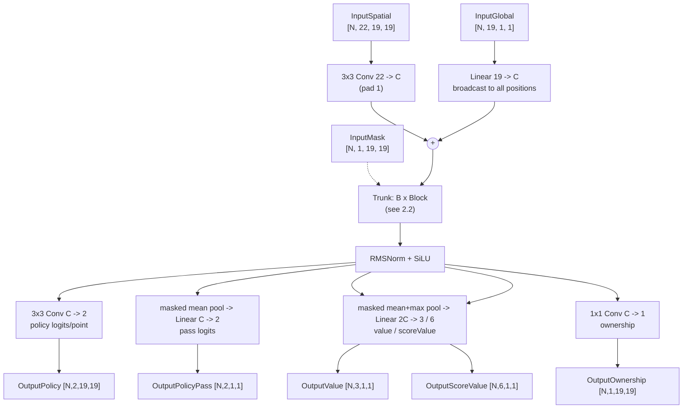
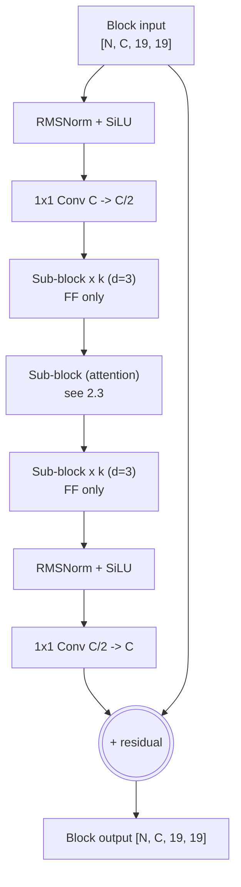

# CGX: A CPU-Native Architecture Proposal for KataGo-Class Go Networks

**Status:** design + measured speed validation (2026-08-31). Strength estimates are
projections; every speed number in this document was measured on real silicon
(8-core AMD Zen 4 @ ~1.5 GHz, AVX512-BF16, OpenVINO 2026.3 CPU plugin).

**One-line summary:** a distilled micro-transformer in the tf2/tf3 family, with
attention *density* as the CPU cost knob — full GEMM efficiency where it matters,
one-third the attention of tf3 — designed to run at 60–90 engine visits/s on 8
desktop cores at ~13.5–14.1k Elo.

---

## 1. Why this shape (the evidence)

Every claim below was measured during this project (see docs/CPU_BACKEND.md):

| Measured fact | Number | Design consequence |
|---|---|---|
| Elo per GFLOP by family | tf2 (10.5M/9.6 GF) > b18 (26M/18.9 GF); tf3-b11c768 (57 GF) ≈ zhizi conv (167 GF) | transformer trunk, not convnet — 3–4× Elo/GFLOP |
| GEMM/FF kernel efficiency | ~700–820 GFLOP/s at block shapes (bf16) | keep all heavy compute as dense 1×1-conv GEMMs |
| Attention cost at these shapes | **~370 GF/s effective — half the FF rate**; 59% of batch-1 runtime at full density | make attention *density* the cost knob |
| int8 on transformer shapes | **0% gain** (81.7→84.1 pos/s measured) — oneDNN int8 only accelerates 3×3 convs | bf16 only; do not design around quantization |
| Engine efficiency vs standalone | 63–91% (avg-batch regime), flat across all threading/batching sweeps | project engine v/s ≈ 0.75 × standalone batch-1 |
| Depth vs width at batch 1 | 6×C512 blocks: 44.6 pos/s vs 14×C384: 27.0 pos/s (similar GFLOP) | prefer fewer, wider blocks for latency |

## 2. The architecture

### 2.1 End-to-end graph

### 2.2 Trunk block (nested bottleneck, tf-style, with the density knob)

Each trunk block wraps `k` sub-blocks (nbt-style): a `C -> C/2` SiLU projection in,
`k` sub-blocks at width `C/2`, then `C/2 -> C` SiLU projection out, plus the block
residual. **Attention runs only in every `d`-th sub-block** (`attn-every = d`); the
rest are SwiGLU feed-forward only.

### 2.3 Sub-blocks (pre-norm)

**Attention sub-block** (every `d`-th): RMSNorm -> Q/K/V 1×1 convs (C/2 -> `W_a`,
`W_a = C/4` in v2 — the width knob — with `H = W_a/32` heads of dim 32) -> reshape/transpose to [N,H,361,32] -> QK^T/sqrt(32)
-> additive board-mask -> softmax -> AV -> transpose/reshape -> output 1×1 conv ->
residual add. Positional encoding: 2D learned RoPE as in tf3 (cost-neutral; the
reference generator omits it for speed benchmarking only).

**Feed-forward sub-block** (all sub-blocks): RMSNorm -> two 1×1 convs (C/2 -> F and
C/2 -> F) -> SwiGLU gate (SiLU(x)*y) -> 1×1 conv F -> C/2 -> residual add.
F = 3 × C/2.

**Op vocabulary (strict):** 1×1/3×3 convolutions (= dense GEMMs, the oneDNN-native
path), RMSNorm (6 cheap elementwise ops), SiLU, one softmax per attention, matmuls
only inside attention, transposes only around attention. No dynamic shapes, no
pools except the two head pools, no other ops.

### 2.4 Size ladder (all shapes measured, bf16, standalone)

**v2 levers (Round D/E, measured):** dropping the attention board-mask chain (valid
at fixed 19x19) +17%; attention width = inner/2 (a second, better cost knob than
density) +23% more; fused-QKV *rejected* (slice overhead beats GEMM gain); head-dim
16 *rejected* (batch-8 collapse).

| Size | C / inner / F | attn (every / width) | Params | b1 pos/s | b8 pos/s |
|---|---|---|---|---|---|
| **CGX-Sv2** | 256 / 128 / 384, 12×3 | 3 / 64 | 6.56M | **92.7** | **131.8** |
| CGX-Sv2 denser | 256 / 128 / 384, 12×3 | 2 / 64 | 6.76M | 75.5 | 121.1 |
| CGX-Sv2 full-attn | 256 / 128 / 384, 12×3 | 1 / 64 | 7.35M | 56.6 | 96.1 |
| **CGX-Mv2** | 384 / 192 / 576, 12×3 | 3 / 96 | 14.71M | **53.8** | 74.3 |
| CGX-Mv2 denser | 384 / 192 / 576, 12×3 | 2 / 96 | 15.16M | 48.3 | 69.9 |
| CGX-S v1 (ref) | 256 / 128 / 384, 12×3 | 3 / 128 | 6.96M | 73–86* | 111–121* |

*same configuration measured 73.2 and 85.7 in different sessions on the shared box —
run-to-run variance ~15%; all lever comparisons above were measured within single runs.

Note on mask-free: the additive off-board mask chain is dead code at exactly 19x19
(the mask is constant). A mask-free net is only correct for fixed 19x19 play; keep
the mask (5 ops/attention) if smaller boards must be supported.

Validation of the generator: the full-attention C512/i256/F768/10×3 reference
measured 35.8/263 ms (b1/b8) vs the real tf3-b10c512's 38.9/238 ms — within ~10%.

### 2.5 Projected engine performance (×0.75 engine efficiency, ×1.085 visits ratio)

| Size | live v/s (est) | analysis v/s (est) | Elo (est, distilled) |
|---|---|---|---|
| CGX-Sv2 | **~72** | ~100 | ~13,300–13,700 |
| CGX-Sv2 denser | ~59 | ~93 | ~13,500–13,900 |
| CGX-Mv2 | **~42** | ~56 | ~13,800–14,100 |

Elo anchors: tf2-b10c384 = 13,712 at 10.5M params / full attention / ~44 engine v/s
(measured). CGX-M has 1.5× tf2's params but 1/3 attention density; distillation from
tf3-b11c768 (14,542) is the compensating factor. These are honest projections with
±150 Elo uncertainty, not measurements.

## 3. Training recipe

1. **Distill, don't train from scratch.** Teacher: `kata1-tf3-b11c768` (14,542 Elo).
   Data: katagotraining.org published training shards (inputs) + teacher logits
   (policy KL + value/score/ownership MSE — the exact loss and validated
   graph→PyTorch tooling already exist in `tools/qat-experiments/`).
2. Standard KataGo training targets as auxiliary losses (the shards contain them).
3. bf16/fp32 training; **no quantization** (measured: int8 gives 0% on these shapes).
4. Sweep `attn-every` ∈ {2,3,4} and blocks {10,12,14} on a small compute budget —
   the speed side of the trade is fully measured above; only the Elo side needs
   training runs.

## 4. What was tested and rejected (measured)

- **int8/VNNI for transformers**: 0% speedup on block shapes (oneDNN int8 kernels
  serve 3×3 convs, not small-K GEMMs). Also earlier: PTQ int8 on b18 capped at 90%
  accuracy, QAT export blocked by an OpenVINO fusion bug (see CPU_BACKEND.md).
- **Depth for latency**: 14×C384 (27 pos/s) loses to 6×C512 (44.6 pos/s) at similar
  FLOPs at batch 1.
- **Convnet trunks**: 3–4× Elo/GFLOP deficit (measured across b18/b28/b40/zhizi).
- **NCHW layout**: 10–19% slower than NHWC for transformer blocks (measured).
- **Mamba/SSM, depthwise-separable, NNUE**: no oneDNN primitive / memory-bound /
  incompatible with MCTS leaf evaluation (reasoned, not measured — flagged as such).

## 5. Integration

The net speaks the exact KataGo ONNX contract (InputSpatial/InputGlobal/InputMask,
the five outputs, metadata props) — it loads directly in the `ov` provider of this
repo's ONNX backend via `katago dumponnx`-style export, or natively once KataGo's
training export writes it. The reference generator is
`tools/cgx-architecture/gen_mininet.py`.

## 6. Open questions

- Elo of 1/3-density attention (the central untested claim — needs training runs)
- Whether `attn-every 2` at C256 (68.5 pos/s b1) or CGX-M is the better live-play point
- Head dim 16 (double the heads at same width) — untested
