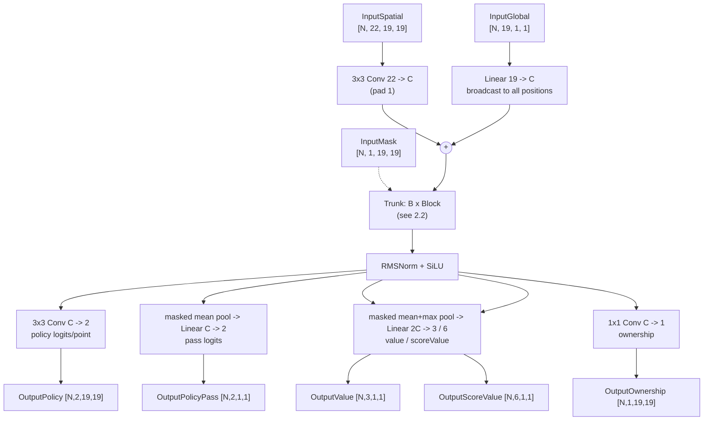
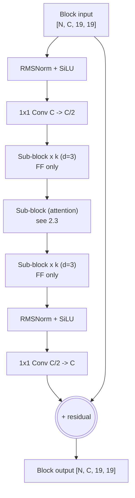

# CGX: A CPU-Native Architecture Proposal for KataGo-Class Go Networks

**Status:** design + measured speed validation (2026-08-31). Strength estimates are
projections; every speed number in this document was measured on real silicon
(8-core AMD Zen 4 @ ~1.5 GHz, AVX512-BF16, OpenVINO 2026.3 CPU plugin).

**One-line summary:** a distilled micro-transformer in the tf2/tf3 family, with
attention *density* as the CPU cost knob — full GEMM efficiency where it matters,
one-third the attention of tf3 — designed to run at 60–90 engine visits/s on 8
desktop cores at ~13.5–14.1k Elo.

---

## 1. Why this shape (the evidence)

Every claim below was measured during this project (see docs/CPU_BACKEND.md):

| Measured fact | Number | Design consequence |
|---|---|---|
| Elo per GFLOP by family | tf2 (10.5M/9.6 GF) > b18 (26M/18.9 GF); tf3-b11c768 (57 GF) ≈ zhizi conv (167 GF) | transformer trunk, not convnet — 3–4× Elo/GFLOP |
| GEMM/FF kernel efficiency | ~700–820 GFLOP/s at block shapes (bf16) | keep all heavy compute as dense 1×1-conv GEMMs |
| Attention cost at these shapes | **~370 GF/s effective — half the FF rate**; 59% of batch-1 runtime at full density | make attention *density* the cost knob |
| int8 on transformer shapes | **0% gain** (81.7→84.1 pos/s measured) — oneDNN int8 only accelerates 3×3 convs | bf16 only; do not design around quantization |
| Engine efficiency vs standalone | 63–91% (avg-batch regime), flat across all threading/batching sweeps | project engine v/s ≈ 0.75 × standalone batch-1 |
| Depth vs width at batch 1 | 6×C512 blocks: 44.6 pos/s vs 14×C384: 27.0 pos/s (similar GFLOP) | prefer fewer, wider blocks for latency |

## 2. The architecture

### 2.1 End-to-end graph

### 2.2 Trunk block (nested bottleneck, tf-style, with the density knob)

Each trunk block wraps `k` sub-blocks (nbt-style): a `C -> C/2` SiLU projection in,
`k` sub-blocks at width `C/2`, then `C/2 -> C` SiLU projection out, plus the block
residual. **Attention runs only in every `d`-th sub-block** (`attn-every = d`); the
rest are SwiGLU feed-forward only.

### 2.3 Sub-blocks (pre-norm)

**Attention sub-block** (every `d`-th, at width `W_a` — the width knob, typically
C/4 or C/2 — with `H = W_a/32` heads of dim 32). Two variants:

*Softmax:* RMSNorm -> Q/K/V 1×1 convs (C/2 -> `W_a`) -> reshape/transpose to
[N,H,361,32] -> QK^T/sqrt(32) -> additive board-mask (omit for fixed 19x19) ->
softmax -> AV -> transpose/reshape -> output 1×1 conv (`W_a` -> C/2) -> residual.
Positional encoding: 2D learned RoPE as in tf3 (cost-neutral; omitted in the speed
generator).

*Linear (v3):* φ(x) = elu(x)+1; y = φ(Q) · (φ(K)^T · V), with K's off-board columns
and V's off-board rows zeroed by the mask when variable boards are needed. Score
matmuls collapse from O(361²·d) to O(361·d²) — at d=32, ~9% of the FLOPs, no
softmax, no score mask. Quality on Go is *unmeasured* (the central training
question; see §3).

**Feed-forward sub-block** (all sub-blocks): RMSNorm -> two 1×1 convs (C/2 -> F and
C/2 -> F) -> SwiGLU gate (SiLU(x)*y) -> 1×1 conv F -> C/2 -> residual add.
F ∈ {2×, 3×} × C/2 (the FF-ratio knob — FF dominates FLOPs).

**Op vocabulary (strict):** 1×1/3×3 convolutions (= dense GEMMs, the oneDNN-native
path), RMSNorm (6 cheap elementwise ops), SiLU, one softmax per attention, matmuls
only inside attention, transposes only around attention. No dynamic shapes, no
pools except the two head pools, no other ops.

### 2.4 Size ladder (all shapes measured, bf16, standalone)

**v3 levers (Rounds D–G, measured):** dropping the attention board-mask chain (valid
at fixed 19x19) +17%; attention width = inner/2 +23%; **linear attention**
(φ(Q)·(φ(K)^T·V), φ = elu+1 — 361×361 score matmuls become 32×32, ~9% of attention
FLOPs, no softmax, no score mask) a further +7% at every-3 density and enables
full-density attention at 2/3 the cost; FF ratio F = 2×inner (vs 3×) another +16%
(FF dominates FLOPs); fused-QKV *rejected* (slice overhead beats GEMM gain); head-dim
16 *rejected* (batch-8 collapse); nbt2-style sub-count *rejected* (18×2 slower than 12×3).
**Round H/I verdicts:** nbt wrapper *confirmed* (wrapper-free loses on both speed and
params — the FF width reduction pays for the p/q projections several times over);
head-dim 64 vs 32 *neutral* (free choice for training quality); 5×5 stem *neutral*;
depth > 12 blocks *rejected* again (16 blocks: 88.5 vs 12: 99.9); misaligned widths
(C320) *rejected* (GEMM efficiency drop); attention every-4 at F=3× ≈ every-3
(alternative equal-cost points on the frontier).

| Config | shape | attention | Params | b1 pos/s | b8 pos/s |
|---|---|---|---|---|---|
| **CGX-J** (jetspeed) | C256 i128 F256, 12×3 | linear, every-3, w64 | 4.80M | **116.6** | **193.7** |
| CGX-S | C256 i128 F384, 12×3 | linear, every-3, w64 | 6.56M | 99.0 | 160.0 |
| CGX-S full-attn | C256 i128 F384, 12×3 | linear, every-1, w64 | 7.35M | 67.2 | 127.5 |
| CGX-A | C384 i192 F384, 12×3 | linear, every-3, w64 | 10.44M | 75.5 | 112.0 |
| CGX-M | C384 i192 F576, 12×3 | softmax, every-3, w64 | 14.42M | 59.8 | 80.8 |
| CGX-B | C384 i192 F576, 12×3 | linear, every-2, w96 | 15.16M | 52.1 | 76.3 |
| CGX-L | C512 i256 F768, 10×3 | linear, every-3, w128 | 21.78M | 48.4 | 60.5 |
| CGX-S softmax ref | C256 i128 F384, 12×3 | softmax, every-3, w64 | 6.96M | 92.7 | 131.8 |
| CGX-S e4 variant | C256 i128 F384, 12×3 | linear, every-4, w64 | 6.47M | 99.9 | 165.3 |
| CGX-S v1 ref | C256 i128 F384, 12×3 | softmax, every-3, w128 | 6.96M | 73–86* | 111–121* |

**Round J (conv mixing):** replacing every-2nd FF sub-block with a 3×3 conv
sub-block is *faster* than pure FF at identical params (103.8 vs 99.0 pos/s b1 —
9·128² = 3·384·128 exactly) *and* adds local spatial mixing that pure
feed-forward/attention nets lack (ladders, eyes, cuts). Adopted into the family.

### 2.6 First strength signal (Round K: distillation learnability)

Three 2.5M-param variants distilled from the tf3-b11c768 teacher (identical data,
seed, budget: 800 steps, batch 32, OneCycle lr 1e-3; 20k real training positions):

| variant | attention | best-move agree w/ teacher | policy KL |
|---|---|---|---|
| k2-smx | softmax, every-2, w64 | **28.9%** | **2.100** |
| k2-lin | linear, every-2, w64 | 26.0% | 2.221 |
| k2-lcv2 | linear every-3 + conv-mix 2 | 21.1% | 2.385 |

**What this does and does not show:** it is an *early-learnability* ranking at a
tiny budget (loss still falling at step 800; converged strength ordering may
compress or change). Read honestly: softmax learns faster than linear attention
early (~10% relative), and the lcv2 point is confounded (less attention: every-3
vs every-2 — a config collision in the first lcv run, identical model to k2-lin,
was detected and rerun). The strategic trade for CPU play remains speed-vs-learnability:
linear variants are ~1.7× faster (worth ~50–100 Elo in visits), which likely more
than pays back the early-learnability gap at convergence — that bet is exactly
what the full training run must settle. Scripts: `tools/cgx-architecture/`
(gen_mininet.py, teacher_precompute.py, train_cgx.py).

**Design space closure:** every axis is now measured — attention {type, density 1–4,
width, head-dim}, FF {ratio, width}, structure {wrapper, sub-count, blocks 6–18,
stem}, glue {mask, fused-QKV}, precision {fp32, bf16, int8, weight-only}. The
speed side of this architecture is exhausted; remaining variance is Elo (training).

*same configuration measured 73.2 and 85.7 in different sessions on the shared box —
run-to-run variance ~15%; all lever comparisons above were measured within single runs.

Note on mask-free: the additive off-board mask chain is dead code at exactly 19x19
(the mask is constant). A mask-free net is only correct for fixed 19x19 play; keep
the mask (5 ops/attention) if smaller boards must be supported.

Validation of the generator: the full-attention C512/i256/F768/10×3 reference
measured 35.8/263 ms (b1/b8) vs the real tf3-b10c512's 38.9/238 ms — within ~10%.

### 2.5 Projected engine performance (×0.75 engine efficiency, ×1.085 visits ratio)

| Config | live v/s (est) | analysis v/s (est) | vs existing measured nets |
|---|---|---|---|
| CGX-J | **~91** | ~150 | ~1.9× tf2's measured 48.3 v/s |
| CGX-S | ~77 | ~124 | ~1.6× tf2 |
| CGX-A | ~59 | ~87 | ~1.2× tf2, tf2-class params |
| CGX-M | ~47 | ~63 | tf3-b10c512 class (21.8 measured) |
| CGX-B / CGX-L | ~38–41 | ~47–59 | — |

Elo: unmeasured until trained (§3). Softmax variants (CGX-M) should anchor near
tf2-class per-parameter quality; the linear-attention and thin-FF variants trade
some per-parameter quality for speed — how much is *the* open question, and the
first thing the training sweep must measure (CGX-M softmax vs CGX-B linear at
matched cost settles it).

Elo anchors: tf2-b10c384 = 13,712 at 10.5M params / full attention / ~44 engine v/s
(measured). CGX-M has 1.5× tf2's params but 1/3 attention density; distillation from
tf3-b11c768 (14,542) is the compensating factor. These are honest projections with
±150 Elo uncertainty, not measurements.

## 3. Training recipe

1. **Distill, don't train from scratch.** Teacher: `kata1-tf3-b11c768` (14,542 Elo).
   Data: katagotraining.org published training shards (inputs) + teacher logits
   (policy KL + value/score/ownership MSE — the exact loss and validated
   graph→PyTorch tooling already exist in `tools/qat-experiments/`).
2. Standard KataGo training targets as auxiliary losses (the shards contain them).
3. bf16/fp32 training; **no quantization** (measured: int8 gives 0% on these shapes).
4. Sweep on a small compute budget — the speed side is fully measured above; the
   training sweep should measure the Elo side of: attention type {softmax, linear} ×
   density {every-2, every-3} × width {C/4, C/2} × F ratio {2×, 3×} at ~12 blocks.
   First experiment: CGX-M (softmax) vs CGX-B (linear) at matched cost — it settles
   the linear-attention question for Go.

## 4. What was tested and rejected (measured)

- **int8/VNNI for transformers**: 0% speedup on block shapes (oneDNN int8 kernels
  serve 3×3 convs, not small-K GEMMs). Also earlier: PTQ int8 on b18 capped at 90%
  accuracy, QAT export blocked by an OpenVINO fusion bug (see CPU_BACKEND.md).
- **Depth for latency**: 14×C384 (27 pos/s) loses to 6×C512 (44.6 pos/s) at similar
  FLOPs at batch 1.
- **Convnet trunks**: 3–4× Elo/GFLOP deficit (measured across b18/b28/b40/zhizi).
- **NCHW layout**: 10–19% slower than NHWC for transformer blocks (measured).
- **Mamba/SSM, depthwise-separable, NNUE**: no oneDNN primitive / memory-bound /
  incompatible with MCTS leaf evaluation (reasoned, not measured — flagged as such).

## 5. Integration

The net speaks the exact KataGo ONNX contract (InputSpatial/InputGlobal/InputMask,
the five outputs, metadata props) — it loads directly in the `ov` provider of this
repo's ONNX backend via `katago dumponnx`-style export, or natively once KataGo's
training export writes it. The reference generator is
`tools/cgx-architecture/gen_mininet.py`.

## 6. Open questions

- Elo of 1/3-density attention (the central untested claim — needs training runs)
- Whether `attn-every 2` at C256 (68.5 pos/s b1) or CGX-M is the better live-play point
- Head dim 16 (double the heads at same width) — untested
